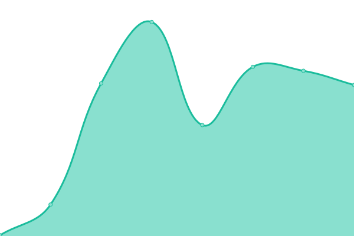

# [📈 Live Status](https://Domain-Connect.github.io/upptime): <!--live status--> **🟩 All systems operational**

This repository contains the open-source uptime monitor and status page for [Domain Connect](http://domainconnect.org), powered by [Upptime](https://github.com/upptime/upptime).

With [Upptime](https://upptime.js.org), you can get your own unlimited and free uptime monitor and status page, powered entirely by a GitHub repository. We use [Issues](https://github.com/Domain-Connect/upptime/issues) as incident reports, [Actions](https://github.com/Domain-Connect/upptime/actions) as uptime monitors, and [Pages](https://Domain-Connect.github.io/upptime) for the status page.

<!--start: status pages-->
<!-- This summary is generated by Upptime (https://github.com/upptime/upptime) -->
<!-- Do not edit this manually, your changes will be overwritten -->
<!-- prettier-ignore -->
| URL | Status | History | Response Time | Uptime |
| --- | ------ | ------- | ------------- | ------ |
|  [Domainconnect.org](https://domainconnect.org) | 🟩 Up | [domainconnect-org.yml](https://github.com/Domain-Connect/upptime/commits/HEAD/history/domainconnect-org.yml) | 

 414ms
     
 | 

<a href="https://status.domainconnect.org/history/domainconnect-org">100.00%</a>
    

|  [Domainconnect.org example service](https://exampleservice.domainconnect.org/) | 🟩 Up | [domainconnect-org-example-service.yml](https://github.com/Domain-Connect/upptime/commits/HEAD/history/domainconnect-org-example-service.yml) | 

 145ms
     
 | 

<a href="https://status.domainconnect.org/history/domainconnect-org-example-service">100.00%</a>
    

|  [Domainconnect.org DynDNS](https://dynamicdns.domainconnect.org/ddnscode?code=test&state=null) | 🟩 Up | [domainconnect-org-dyn-dns.yml](https://github.com/Domain-Connect/upptime/commits/HEAD/history/domainconnect-org-dyn-dns.yml) | 

 294ms
     
 | 

<a href="https://status.domainconnect.org/history/domainconnect-org-dyn-dns">100.00%</a>
    

|  [Domainconnect.org Status website](https://status.domainconnect.org) | 🟩 Up | [domainconnect-org-status-website.yml](https://github.com/Domain-Connect/upptime/commits/HEAD/history/domainconnect-org-status-website.yml) | 

 265ms
     
 | 

<a href="https://status.domainconnect.org/history/domainconnect-org-status-website">100.00%</a>
    

|  [Domain Connect Open template editor](https://domainconnect.paulonet.eu/dc/free/templateedit) | 🟩 Up | [domain-connect-open-template-editor.yml](https://github.com/Domain-Connect/upptime/commits/HEAD/history/domain-connect-open-template-editor.yml) | 

 757ms
     
 | 

<a href="https://status.domainconnect.org/history/domain-connect-open-template-editor">100.00%</a>
    

|  [Domain Connect Demo DNS Provider](https://domainconnect.paulonet.eu/) | 🟩 Up | [domain-connect-demo-dns-provider.yml](https://github.com/Domain-Connect/upptime/commits/HEAD/history/domain-connect-demo-dns-provider.yml) | 

 313ms
     
 | 

<a href="https://status.domainconnect.org/history/domain-connect-demo-dns-provider">100.00%</a>
    

|  [Domain Connect IAM](https://lemur-2.cloud-iam.com/auth/realms/domainconnect-iam/account/applications) | 🟩 Up | [domain-connect-iam.yml](https://github.com/Domain-Connect/upptime/commits/HEAD/history/domain-connect-iam.yml) | 

 512ms
     
 | 

<a href="https://status.domainconnect.org/history/domain-connect-iam">100.00%</a>
    

|  [Demo DNS Provider NS1](ns1.dc.paulonet.eu) | 🟩 Up | [demo-dns-provider-ns-1.yml](https://github.com/Domain-Connect/upptime/commits/HEAD/history/demo-dns-provider-ns-1.yml) | 

 122ms
     
 | 

<a href="https://status.domainconnect.org/history/demo-dns-provider-ns-1">100.00%</a>
    

<!--end: status pages-->

[**Visit our status website →**](https://Domain-Connect.github.io/upptime)

## 📄 License

- Powered by: [Upptime](https://github.com/upptime/upptime)
- Code: [MIT](./LICENSE) © [Domain Connect](http://domainconnect.org)
- Data in the `./history` directory: [Open Database License](https://opendatacommons.org/licenses/odbl/1-0/)
